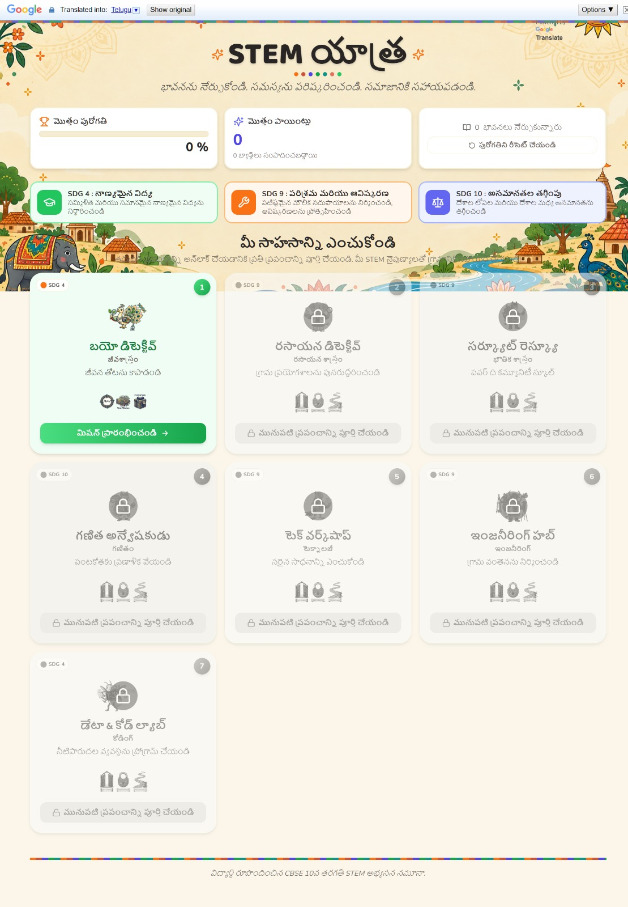

# STEM Yatra

**Learn the concept. Solve the problem. Help the community.**

🔗 **Live site:** [stemyatra.vercel.app](https://stemyatra.vercel.app/)

STEM Yatra is a village-themed interactive learning prototype for CBSE Class X students. Learners travel through a sequence of STEM missions, meet folk-art-inspired mascot guides, solve subject-based challenges, collect points and badges, and connect classroom concepts with real community problems.

The experience is built as a React + TypeScript web app with a Madhubani-inspired visual identity, mission cards, progress tracking, animated feedback, and subject worlds spanning biology, chemistry, physics, mathematics, technology, engineering, and coding.


---

## Table of Contents

- [About](#about)
- [What Learners Do](#what-learners-do)
- [Learning Worlds](#learning-worlds)
- [Art & Cultural Design](#art--cultural-design)
- [Multilingual Support](#multilingual-support)
- [SDG Alignment](#sdg-alignment)
- [Features](#features)
- [Screenshots](#screenshots)
- [Tech Stack](#tech-stack)
- [Getting Started](#getting-started)
- [Project Structure](#project-structure)
- [Team](#team)
- [License](#license)

---

## About

Most STEM revision tools test whether a student can *recall* a formula. STEM Yatra tests — and teaches — whether a student can *apply* one. Every mission is a short, self-contained, click-based challenge built around a real CBSE Class X concept, wrapped in a story about helping a village solve an actual problem: powering a school, restoring a lab, planning a harvest, building a bridge.

Points, badges, and progress bars exist here for a reason: not to bribe attention, but to make understanding *visible* — every mission ends with a plain-language summary of the concept a learner just used, so the takeaway is explicit instead of assumed.

---

## What Learners Do

- Explore a village map and unlock STEM worlds one by one.
- Complete short mission-based activities tied to real concepts.
- Earn points, badges, and concept summaries after each mission.
- Track progress locally in the browser — no login required.
- Celebrate completion after finishing all seven worlds.

---

## Learning Worlds

| World | Subject | Mission | Core ideas |
| --- | --- | --- | --- |
| Bio Detective | Biology | Save the Living Garden | Photosynthesis, water transport, stomata, plant systems |
| Chemical Detective | Chemistry | Restore the Village Laboratory | Combination, decomposition, displacement, double displacement, pH |
| Circuit Rescue | Physics | Power the Community School | Closed circuits, Ohm's law, electrical power, series and parallel circuits |
| Maths Explorer | Mathematics | Plan the Harvest | Mean, median, mode, probability, data-based decisions |
| Tech Workshop | Technology | Choose the Right Tool | Rainwater harvesting, filtration, solar energy, context-aware technology |
| Engineering Hub | Engineering | Build the Village Bridge | Beam strength, trusses, load distribution, design choices |
| Data & Code Lab | Coding | Program the Irrigation System | Algorithms, sequencing, conditionals, debugging |

<!-- TODO: Add a screenshot of the "Choose Your Adventure" mission-select screen here -->
<!--  -->

---

## Art & Cultural Design

STEM Yatra's visual world is deliberately built in an Indian folk-art style rather than generic ed-tech UI. The interface draws on Madhubani-inspired borders, motifs, and a village setting, and every mascot — an elephant, a parakeet, a rhinoceros, a squirrel, a firefly, a peacock, and a donkey — is designed as an Indian animal rooted in that same aesthetic rather than a stock cartoon character.

This is a design choice, not decoration: Indian visual art traditions are among the richest in the world, yet they're rarely reflected in the ed-tech tools students actually use day to day, which tend to default to the same generic, culturally neutral look. STEM Yatra tries to close that gap — a CBSE Class X student should feel like the platform was made *for* their context, not translated for it.

<!-- TODO: Add close-up screenshots of the mascots and Madhubani-style background/borders here -->
<!--  -->
<!--  -->

---

## Multilingual Support

STEM Yatra is built to reach students beyond an English-only audience, with in-app translation covering major Indian languages including Bengali, Odia, Tamil, Kannada, and Telugu — so the same missions, mascots, and SDG framing stay accessible regardless of a learner's first language.

| Bengali | Odia |
|---|---|
|  |  |

| Tamil | Kannada |
|---|---|
|  |  |

| Telugu |
|---|
|  |

## SDG Alignment

Missions on STEM Yatra are organised around real UN Sustainable Development Goals — this isn't an afterthought, it's how the platform's "Choose Your Adventure" screen is structured:

- **SDG 4 — Quality Education:** the entire product is built around inclusive, equitable, and genuinely effective learning, not just access to content.
- **SDG 9 — Industry & Innovation:** missions are framed as rebuilding village infrastructure, so students practise STEM concepts by solving the kind of resilient-infrastructure problems SDG 9 addresses.
- **SDG 10 — Reduced Inequalities:** the app is lightweight, works on low-end devices, and needs no login or ongoing data — a deliberate choice for equitable access in under-resourced communities.

<!-- TODO: Add a screenshot of the SDG badge cards on the homepage here -->
<!--  -->

---

## Features

- Sequential mission unlocking with prerequisites.
- Mascot-led storytelling for each STEM subject.
- Points, badges, progress percentage, and learned-concept tracking.
- Reset and completion celebration flows.
- Local browser storage through `localStorage`.
- Responsive interface styled with Tailwind CSS.
- Motion and icon support through Framer Motion and Lucide React.
- Built-in page translation via Google Translate widget, covering major Indian languages such as Bengali, Odia, and Tamil.

---

## Screenshots

The homepage is shown at the top of this README. A few more angles are still needed — drop new screenshots straight into the repo root alongside the others, then link them here the same way:

<!-- TODO: Add remaining screenshots below. Suggested set:
- Mission select ("Choose Your Adventure") close-up
- A mission in progress (question + feedback)
- Mission complete / badge unlocked screen
- Mascot close-ups

Example of how to link a new root-level file with spaces in its name:

-->

| | |
|---|---|
| <!--  --> | <!--  --> |

---

## Tech Stack

- React 18
- TypeScript
- Vite
- Tailwind CSS
- Framer Motion
- Lucide React
- ESLint
- Deployed on Vercel

---

## Getting Started

Install dependencies:

```bash
npm install
```

Start the development server:

```bash
npm run dev
```

Create a production build:

```bash
npm run build
```

Preview the production build locally:

```bash
npm run preview
```

Run checks:

```bash
npm run lint
npm run typecheck
```

---

## Project Structure

```text
src/
  components/        Reusable interface and game components
  data/               World and progress definitions
  hooks/              Progress persistence logic
  screens/             Village map, mission, and celebration screens
  worlds/              Subject-specific mission experiences
```

Static visual assets live in the root asset folders, including character art, subject card graphics, mission state graphics, UI icons, and decorative Madhubani-style assets.

---

## Team

Built by **Team MEOW** for InnoHack 2.0, VIT.

- Sampriti Halder — 25BBT0025
- Atreyee Mitra — 25BBT0053
- Ananjan Mitra — 25BBT0056
- Duradarshee Chinara— 25BCE0459


---

## License

This project is licensed under the MIT License. See [`LICENSE`](./LICENSE) for details.
